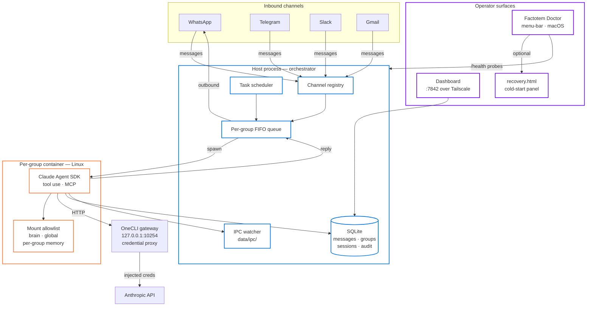
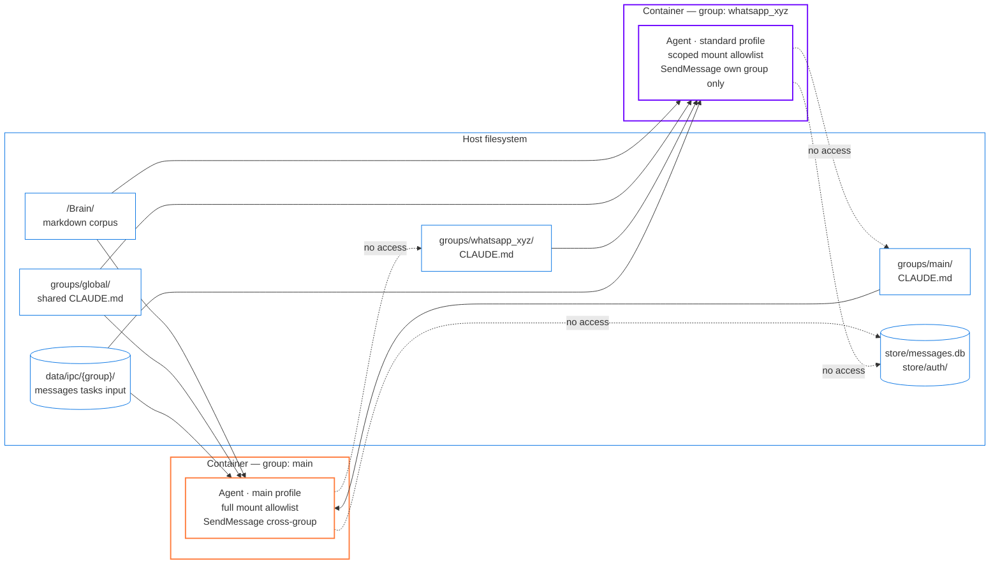
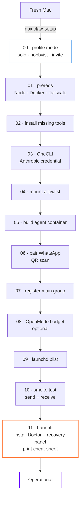

# Factotem

> **Personal AI infrastructure that lives on your machine, owned by you, customised to your life.**
>
> Factotem brings together messaging channels, containerised Claude agents, and an operator dashboard into a single deployment that you fork, modify, and run yourself. No SaaS to depend on, no central control plane — your agents, your containers, your data, on the hardware you choose.

---

## Vision

Most "AI assistant" products are SaaS — your agents, your data, and your control surface live on someone else's infrastructure. Factotem inverts that: the entire stack runs on a Mac (or Linux box) you own, behind your network boundary, against credentials you hold. The codebase is small enough to understand end-to-end and the architecture is structured so that **the operator is always the highest-trust party** — the orchestrator never trusts agent output, the dashboard never trusts inbound messages, and every destructive action passes through a typed-confirm gate.

The medium-term arc is to evolve Factotem from a single-operator tool into a **multi-deployment, multi-tier platform** where a segment admin (e.g. running an instance on a community Mac Mini) can operate independently of the platform aggregator, with permission boundaries enforced as a structural property of the system rather than a config file. v1 ships the single-operator primitive; v2 is multi-deployment federation; v3 is multi-tenant.

This fork is built on the [NanoClaw](https://github.com/qwibitai/nanoclaw) foundation (full credit below) and carries forward its core philosophy — small, container-isolated, skills-over-features — while adding the surfaces an operator needs to actually run this at home or for a small organisation.

---

## What's in the box

- **Multi-channel messaging** — WhatsApp, Telegram, Slack, Discord, Gmail. Channels self-register at startup; add one with a `/add-<channel>` skill.
- **Per-group container isolation** — every chat group runs its agent in its own Linux container with its own mount allowlist, its own `CLAUDE.md` memory, and its own SQLite session record. Bash-in-the-agent is safe because Bash runs inside the container, not on your host.
- **Scheduled tasks** — recurring jobs that wake an agent and message you back.
- **Operator dashboard** — local web UI on `:7842` over Tailscale. Server health, activity feed, group management, cost tracking, alerts, audit log.
- **Factotem Doctor** — signed + notarised macOS menu-bar app. Probes Docker / OneCLI / NanoClaw every 5s, surfaces multi-instance state honestly, exposes a typed-confirm `Repair Stack…` action for cold-start recovery.
- **claw-setup wizard** — twelve-step cold-start that takes a fresh Mac from "nothing" to "agent alive on WhatsApp" without manual config-file editing.
- **OneCLI gateway** — local credential proxy at `127.0.0.1:10254`; secrets never reach agent containers directly.
- **Brain integration** — markdown ticket store synced via Google Drive; cross-linked to KanbanPro via `kanbanpro://` URLs.

---

## Quick start

```bash
gh repo fork donkruger/factotem --clone
cd nanoclaw
claude
```

Then in the Claude Code prompt:

```
/setup
```

Or run the full guided wizard from a regular terminal:

```bash
npx claw-setup
```

The wizard walks twelve steps (host prereqs → OneCLI → Anthropic auth → mount allowlist → container build → WhatsApp pairing → main group registration → launchd install → smoke test → handoff) and ends by installing the Factotem Doctor to `/Applications/`.

> Commands prefixed with `/` are [Claude Code skills](https://code.claude.com/docs/en/skills) — type them inside the `claude` CLI prompt, not your shell. If you don't have Claude Code, get it at [claude.com/product/claude-code](https://claude.com/product/claude-code).

---

## Architecture at a glance



Single Node.js process for the orchestrator. Channels are added via skills and self-register at startup — the orchestrator connects whichever ones have credentials present. Per-group message queue with global concurrency control. Agent execution happens entirely inside Linux containers; the host never executes agent-suggested code.

For full detail see [`docs/ARCHITECTURE.md`](docs/ARCHITECTURE.md), [`docs/SPEC.md`](docs/SPEC.md), [`docs/SECURITY.md`](docs/SECURITY.md), and [`docs/OPERATIONS.md`](docs/OPERATIONS.md).

---

## Per-group isolation model

This is the security primitive most worth understanding before contributing or modifying agent-runner code:



**Trust boundaries (top to bottom of trust):**

1. **Operator** (you, at the keyboard) — highest trust
2. **Orchestrator** (the Node host process) — trusted to mediate
3. **Main group container** — full mount allowlist; can `SendMessage` cross-group
4. **Per-group containers** — scoped mounts; can only `SendMessage` to own group
5. **Inbound message content** — never trusted; treated as data, never executed

Every per-group container sees:
- Its own `groups/{name}/CLAUDE.md` (memory)
- The shared `groups/global/CLAUDE.md` (brand voice, common rules)
- The Brain corpus (read-only by default)
- Its own slice of `data/ipc/{group}/`

It does **not** see other groups' memory, the SQLite database, or `store/auth/`.

The host filters mounts before container spawn (`src/container-runner.ts`). The agent-runner inside the container enforces tool-level scoping (`container/agent-runner/src/ipc-mcp-stdio.ts`). Both layers must agree before a tool call lands.

---

## Operator surfaces

Three places to operate Factotem after it's installed:

| Surface | Where | What it's for |
|---|---|---|
| **Factotem Doctor** | macOS menu bar | Live health probe (Docker / OneCLI / NanoClaw / port :7842), Repair Stack action with typed-confirm gate, Settings, log tail. Always visible — your first read on whether the stack is alive. |
| **Dashboard** | `http://<host>:7842` over Tailscale | Server health, activity feed, group management, cost tracking, alerts, audit log. Authenticated via Tailscale (single-operator) or `operators.json` (multi-operator). |
| **Messaging** | The trigger word in any registered channel | Talk to your assistant. Trigger word configurable; default `@Andy` (Don's fork uses `@Ben`). |

Plus two CLIs:

- **`claude` + `/setup` / `/customize` / `/debug`** — the AI-native operator surface; ask Claude Code to walk through the codebase, modify behaviour, or diagnose an incident.
- **`npx claw-setup`** — guided cold-start wizard for fresh deployments. Idempotent + resumable.

---

## Cold-start flow

`npx claw-setup` walks an operator from "nothing installed" to "menu-bar Doctor visible, agent alive on WhatsApp" in roughly 30 minutes:



State persists at `~/.config/nanoclaw/setup-state.json`; rerun with `--resume` to pick up where you stopped. See [`docs/SETUP_WIZARD.md`](docs/SETUP_WIZARD.md) for full step semantics, recovery, and the standalone installers (`scripts/install-recovery.sh`, `scripts/install-doctor.sh`).

---

## Customising

Factotem doesn't use configuration files for behaviour — it uses code. To change something, tell Claude Code what you want:

```
"Change the trigger word to @Bob"
"Make replies shorter and more direct in the work group"
"Add a custom greeting when I say good morning"
"Store conversation summaries weekly"
```

Or run `/customize` for a guided change. The codebase is small enough that this is safe — and tracked changes mean nothing leaks into your fork unintentionally.

### Skills over features

Capabilities are added as skills, not as code merged into the base. Want Telegram? Don't PR it into the orchestrator — fork, branch, open a PR. We'll create a `skill/telegram` branch from your work, and other operators run `/add-telegram` on their own forks. Each operator ends up with clean code that does exactly what they need; nobody inherits features they don't want.

Skill types:

- **Feature skills** (`/add-whatsapp`, `/add-telegram`) — merge a `skill/*` branch
- **Utility skills** (`/claw`) — ship code alongside `SKILL.md`
- **Operational skills** (`/setup`, `/debug`) — instruction-only workflows
- **Container skills** (`container/skills/`) — loaded inside the agent container at runtime

See [`CONTRIBUTING.md`](CONTRIBUTING.md) and [`docs/skills-as-branches.md`](docs/skills-as-branches.md) for the full taxonomy.

---

## Project structure

```
nanoclaw/
├── src/                              orchestrator (single Node process)
│   ├── index.ts                      state, message loop, agent invocation
│   ├── channels/registry.ts          channel registry (skills self-register)
│   ├── ipc.ts                        IPC watcher · task processing
│   ├── router.ts                     message formatting · outbound routing
│   ├── group-queue.ts                per-group FIFO + global concurrency
│   ├── container-runner.ts           spawns streaming agent containers
│   ├── task-scheduler.ts             recurring jobs
│   ├── http/                         dashboard HTTP server (Phase 0)
│   └── db.ts                         SQLite operations
├── container/
│   ├── agent-runner/src/             Claude Agent SDK driver inside containers
│   ├── skills/                       container-side skills (browser, status)
│   └── build.sh                      Docker build w/ git-sha tag
├── dashboard/                        Next.js operator dashboard (Phase 0)
│   └── src/                          Server Health · Activity · Groups · Cost · Alerts · Audit
├── cli/
│   ├── claw-doctor/                  Phase 1 Tauri menu-bar app (Rust + React)
│   └── claw-setup/                   cold-start wizard (TypeScript)
├── scripts/
│   ├── install-recovery.sh           Phase 0 recovery panel installer
│   ├── install-doctor.sh             Phase 1 Doctor installer
│   ├── recovery/recovery.html        cold-start operator panel
│   └── set-auth-mode.sh              api-key / oauth-workaround toggle
├── groups/{name}/CLAUDE.md           per-group memory (isolated)
├── data/ipc/{group}/                 host↔container IPC namespace
├── store/                            messages.db · auth/
└── docs/                             SPEC · ARCHITECTURE · SECURITY · OPERATIONS · SETUP_WIZARD · CHANGE_LOG
```

Critical files for anyone (human or agent) modifying behaviour:

- **`src/index.ts`** — the orchestrator. Message loop, agent invocation, IPC fan-in.
- **`src/container-runner.ts`** — mount filtering and container spawn. Trust boundary.
- **`container/agent-runner/src/ipc-mcp-stdio.ts`** — tool-scope enforcement inside the container.
- **`docs/REQUIREMENTS.md`** — design philosophy and tier framing (single-operator → multi-deployment → multi-tenant).
- **`docs/CHANGE_LOG.md`** — every shipped change with date, rationale, and recovery tag.

---

## Phase status

| Phase | Status | What |
|---|---|---|
| **Phase 0** — Dashboard, telemetry, recovery panel | ✓ Shipped | Operator HTTP server on :7842, `agent_turns` schema, six dashboard panels, `recovery.html` cold-start surface |
| **Phase 1** — Tauri Doctor menu-bar app | ✓ Shipped | Multi-instance probe, Repair Stack, Settings + Logs, code-signed + notarised, wizard installs to `/Applications` |
| **Phase 2** — Release pipeline + auto-updates | ✓ Shipped | GitHub Actions builds signed + notarised .dmg on `v*` tag push; Doctor auto-detects new releases via Tauri updater, operator approves install |
| **Phase 3** — Multi-deployment federation (v2) | Planned | Aggregator app surveys multiple deployments over Tailscale; per-machine tokens; fleet view |
| **Phase 4** — Multi-tenant boundary (v3) | Planned | Segment admin permission tier; tenant isolation; productisation |

## Releases

The Doctor menu-bar app ships as a notarised `.dmg` from the public mirror at [github.com/RichardBNel/Factotem/releases](https://github.com/RichardBNel/Factotem/releases). New versions auto-detect on running v0.1.3+ installs — operator approves each install via the Settings window. The source repo (`donkruger/factotem`) is private; CI builds + signs there and pushes release artefacts to the public mirror.

For the operator update flow, manual download/upgrade paths, and trust model see [`docs/RELEASES.md`](docs/RELEASES.md). For the maintainer rules — versioning, tag namespace, the five-file version bump, CHANGE_LOG format, asset naming, pre-release flagging, and the rollback procedure — see [Release conventions](docs/RELEASES.md#release-conventions).

See [`docs/RELEASES.md`](docs/RELEASES.md) for the full release model: download paths, auto-update flow, manual downgrade, trust model, and the maintainer tag-and-publish runbook.

The orchestrator + dashboard + claw-setup wizard ship via the fork-and-modify workflow (`git pull` + `npm run build`) — they're not auto-updated because operators customise them. Only the Doctor (binary, signed) is auto-updateable.

See [`docs/CHANGE_LOG.md`](docs/CHANGE_LOG.md) for the full timestamped history of what shipped when.

---

## Requirements

- **macOS** or Linux (the Doctor menu-bar app is macOS-only; the orchestrator runs on either)
- **Node.js 20+**
- **[Claude Code](https://claude.ai/download)**
- **[Docker Desktop](https://docker.com/products/docker-desktop)** (default) or [Apple Container](https://github.com/apple/container) on macOS
- **[Tailscale](https://tailscale.com/)** for accessing the dashboard from other devices on your tailnet
- **An Anthropic API key or subscription OAuth token** (configured into OneCLI; never passed to containers directly)
- **Apple Developer ID** if you want to sign + notarise your own Doctor build (otherwise build it ad-hoc-signed)

---

## Third-party / open-source models

Factotem speaks the Anthropic API format. Set in your `.env`:

```bash
ANTHROPIC_BASE_URL=https://your-api-endpoint.com
ANTHROPIC_AUTH_TOKEN=your-token-here
```

This works with [Ollama](https://ollama.ai) via an API proxy, [Together AI](https://together.ai), [Fireworks](https://fireworks.ai), or any custom deployment that speaks the Anthropic format.

---

## Roots & acknowledgments

Factotem is built on the [NanoClaw](https://github.com/qwibitai/nanoclaw) foundation, which is itself a deliberate pruning of [OpenClaw](https://github.com/openclaw/openclaw) into a single-process, container-isolated, skills-over-features primitive. The container-isolated agent model, the channel-as-skill registry, and the no-config-file philosophy come directly from NanoClaw and remain unchanged in this fork.

What this fork (Factotem) adds on top:

- **Operator dashboard** at `:7842` with six panels (Phase 0)
- **Tauri Doctor** menu-bar app with multi-instance probe + Repair Stack (Phase 1)
- **claw-setup** cold-start wizard
- **Brain + KanbanPro** integration for ticket/task lifecycle
- **OAuth-workaround auth mode** with launchd watcher for rotating subscription tokens
- **Audit log + reversible-undo** dashboard surface
- **`agent_turns`** SDK-faithful telemetry schema (32 columns) for cost tracking
- A more deliberate **trust boundary** posture (operators.json, scopes, typed-confirm gates) suitable for multi-operator + future multi-tenant evolution

Package name remains `nanoclaw` for backward-compatibility with existing skill branches and the upstream channel ecosystem; the user-facing brand is **Factotem** when referring to the operator surfaces, and **NanoClaw** when referring to the underlying orchestrator.

---

## License

MIT.
